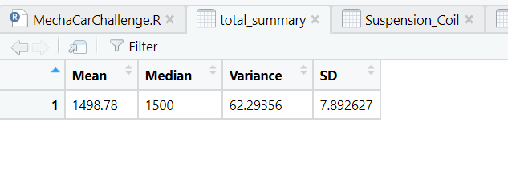
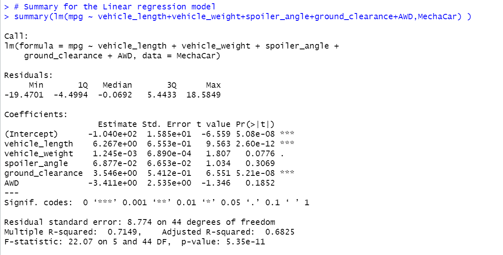
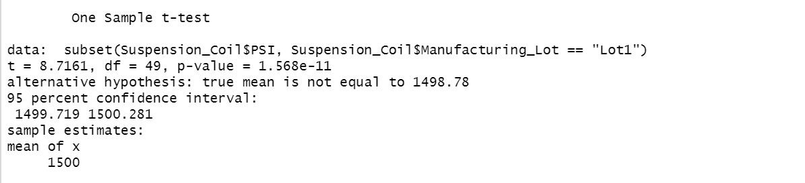
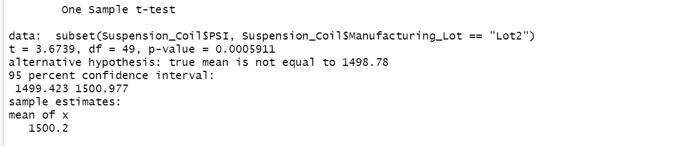

# MechaCar_Statistical_Analysis

## Overview

### Resources
R, R Studio

### Linear Regression to Predict MPG

  - Six data points from 50 prototype vehicles are used to run this multi-linear regression model MechaCar.csv. These are shown to be strong relationships between vehicle length, ground clearance and MPG.
  - The MPG intercept factor shows a high correlation which could indicate that other significant data points were not included in this analysis.
  - The MPG intercept coefficient has a high correlation which leads one to believe that this research may have missed some important data points.

### Summary Statistics on Suspension Coils

  - As determined variance is within 100 psi when viewed as a whole. This is false because Lot 3 is the single factor most responsible for the negative impact on overall performance, having a variance of more than 170.
  - Data found in Suspension_Coil.csv

### T-Test on Suspension Coils

Lot1 outperformed the other two locations the most. The shallowest variations and consistency not observed in either of the other plants. As a result, the null hypothesis is not disproved.

Lot2 displays excellent mean and median findings but the variances are questionable. The null hypothesis is not disproved when variance and p-value are taken into account however it is advised that the location work with Lot 1, which is performing more consistently.

Lot3 has not been produced with the same tolerance as the company requires. It is advised that procedures, employees, equipment, and tools be inspected. The measurements at this location have undoubtedly had a negative impact on business performance.

### Summary

A linear regression on city and highway fuel efficiency is another statistical analysis that can be done to see where MechaCar stands in comparison to its rivals. Nowadays, gas prices are high, making it a crucial factor that many people consider when buying a new car. The following metrics can be used in this analysis:

  - City and highway fuel efficiency: dependent variable
  - Horse power: independent variable
  - Vehicle weight: independent variable
  - AWD capabilities: independent variable
