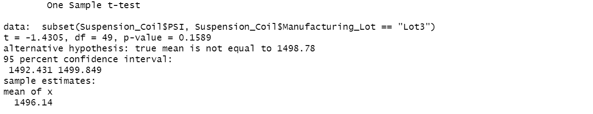

# MechaCar_Statistical_Analysis

## Overview

### Linear Regression to Predict MPG

  - Six data points from 50 prototype vehicles are used to run this multi-linear regression model MechaCar.csv. These are shown to be strong relationships between vehicle length, ground clearance and MPG.

  - The MPG intercept factor shows a high correlation, which could indicate that other significant data points were not included in this analysis.

  - The MPG intercept coefficient has a high correlation, which leads one to believe that this research may have missed some important data points.

### Summary Statistics on Suspension Coils

  - As determined variance is within 100 psi when viewed as a whole. This is false because Lot 3 is the single factor most responsible for the negative impact on overall performance, having a variance of more than 170.

  - Data found in Suspension_Coil.csv

### T-Test on Suspension Coils

